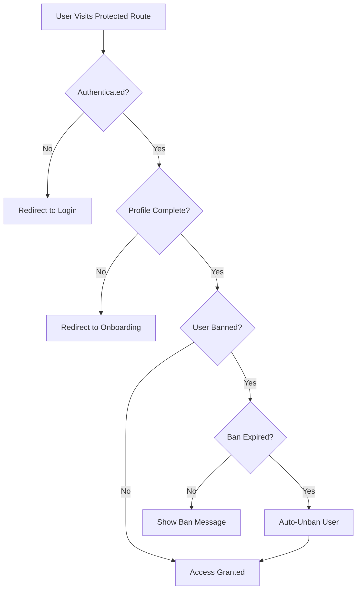
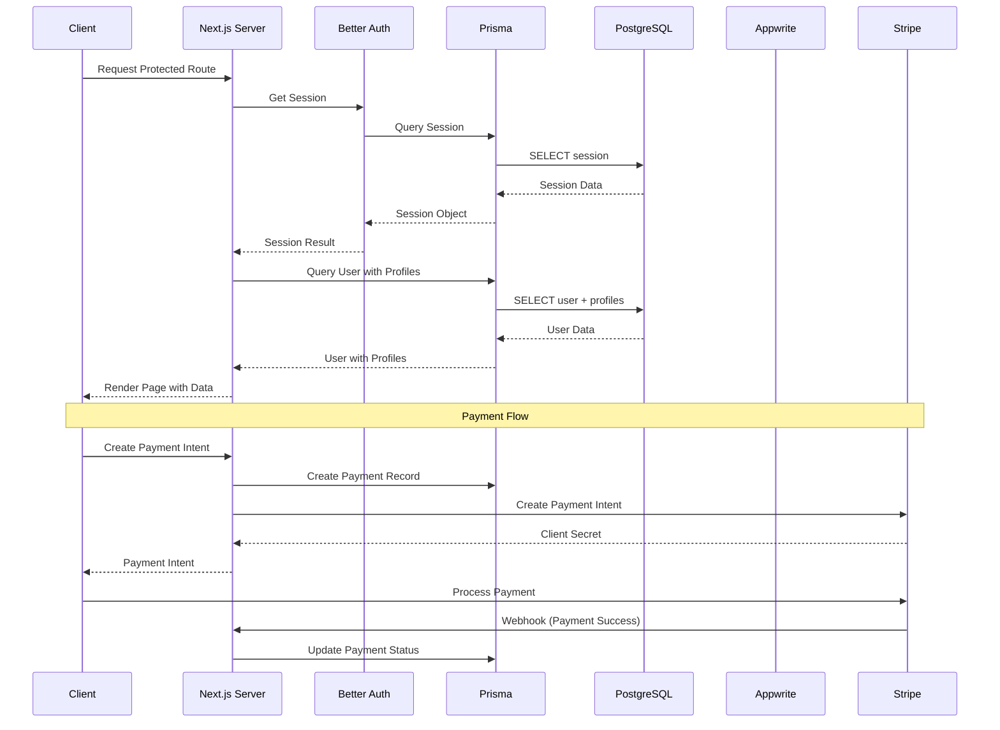

# TeacherHub Project Analysis

## Project Overview

TeacherHub is a full-stack Next.js 16 platform connecting students with teachers for tutoring and educational services. It provides a marketplace where teachers can advertise their expertise and students can find tutors based on their learning needs.

The platform enables:
- **For Students**: Search for teachers, book sessions, manage contracts, communicate via messaging, and track learning progress
- **For Teachers**: Create professional profiles, advertise expertise, manage bookings, communicate with students, and receive payments
- **For Admins**: User management, session monitoring, impersonation capabilities, and platform analytics

## Technology Stack

### Core Framework
- **Next.js 16.0.1** - React framework with App Router
  - Server Components for optimal performance
  - API routes for backend functionality
  - Route groups for organized routing structure
- **React 19.2.0** - UI library with latest features
- **TypeScript 5** - Type safety across the application
- **Prisma 6.18.0** - ORM with PostgreSQL database
  - Type-safe database queries
  - Migration management
  - Prisma Accelerate extension for connection pooling
- **Tailwind CSS 4** - Utility-first CSS framework
  - ShadCN UI component library integration
  - Dark mode support via next-themes

### Authentication & Authorization
- **Better Auth 1.3.34** - Modern authentication system
  - Email/password authentication
  - Session management with Prisma adapter
  - Admin plugin with role-based access control (RBAC)
  - Impersonation support for admin users
  - Automatic ban expiration handling
  - Session tracking (IP address, user agent)

### File Storage
- **Appwrite 21.4.0** - Cloud storage service
  - Teacher intro videos (max 50MB, 3 minutes)
  - Profile images with image processing
  - Message attachments (images, files, audio, video)
  - Server-side uploads to avoid CORS issues
  - File deletion and replacement capabilities

### Payment Processing
- **Stripe 20.0.0** - Payment integration
  - Payment intents for secure transactions
  - Webhook handling for payment status updates
  - Subscription management (BASIC, PREMIUM plans)
  - Support for bookings and contracts
  - Multi-currency support (default USD)

### UI Components
- **Radix UI** - Accessible component primitives
  - Dialog, Dropdown, Popover, Select, Tabs, Tooltip, etc.
- **ShadCN UI** - Pre-built component library
  - Consistent design system
  - Customizable components
- **Recharts 2.15.4** - Data visualization for admin dashboards
- **React Hook Form 7.66.0** - Form management with validation
- **Zod 4.1.12** - Schema validation
  - Type-safe form validation
  - Server-side validation

### Additional Libraries
- **@dnd-kit** - Drag and drop functionality for UI interactions
- **date-fns 4.1.0** - Date manipulation and formatting
- **SWR 2.3.7** - Data fetching with caching and revalidation
- **Sonner 2.0.7** - Toast notifications
- **react-easy-crop** - Image cropping for profile pictures
- **canvas-to-blob** - Image processing utilities

## Architecture Overview

### Application Structure

```
src/
├── app/                    # Next.js App Router pages
│   ├── (auth)/            # Authentication routes (login, signup, reset password)
│   ├── (dashboard)/       # Protected dashboard routes
│   │   ├── teacher/       # Teacher-specific routes
│   │   │   ├── advertisements/  # Expertise advertisements
│   │   │   ├── contracts/        # Contract management
│   │   │   ├── sessions/         # Session scheduling
│   │   │   ├── students/         # Student management
│   │   │   └── profile/          # Profile management
│   │   ├── student/       # Student-specific routes
│   │   │   ├── advertisements/  # Learning need advertisements
│   │   │   ├── contracts/        # Contract viewing
│   │   │   ├── schedule/         # Schedule management
│   │   │   ├── teachers/         # Teacher search
│   │   │   └── profile/          # Profile management
│   │   └── (shared)/      # Shared routes
│   │       ├── bookings/         # Booking management
│   │       ├── contracts/        # Contract details
│   │       ├── messages/         # Messaging system
│   │       ├── notifications/    # Notifications
│   │       └── settings/         # User settings
│   ├── admin/             # Admin panel routes
│   │   └── (dashboard)/   # Admin dashboard
│   │       ├── users/            # User management
│   │       └── settings/        # Admin settings
│   ├── api/               # API routes
│   │   ├── auth/         # Better Auth endpoints
│   │   ├── messages/     # Messaging API
│   │   ├── payments/     # Payment processing
│   │   ├── upload/       # File uploads
│   │   └── user/         # User profile API
│   ├── marketplace/       # Public teacher marketplace
│   ├── onboarding/        # Multi-step onboarding flow
│   ├── teachers/          # Public teacher profiles
│   │   └── [id]/         # Individual teacher pages
│   └── page.tsx          # Landing page
├── components/            # React components
│   ├── admin/            # Admin-specific components
│   │   ├── admin-dashboard-wrapper.tsx
│   │   ├── user-management.tsx
│   │   ├── session-management.tsx
│   │   └── user-growth-chart.tsx
│   ├── advertisements/   # Advertisement components
│   │   ├── expertise-ad-*.tsx
│   │   └── learning-need-*.tsx
│   ├── bookings/         # Booking components
│   ├── contracts/        # Contract components
│   ├── dashboard/        # Dashboard components
│   ├── messages/         # Messaging system components
│   │   ├── message-bubble.tsx
│   │   ├── message-input.tsx
│   │   ├── audio-message.tsx
│   │   ├── video-message.tsx
│   │   └── emoji-picker.tsx
│   ├── onboarding/       # Onboarding step components
│   │   ├── role-selection-step.tsx
│   │   ├── basic-info-step.tsx
│   │   ├── professional-details-step.tsx
│   │   ├── learning-details-step.tsx
│   │   ├── availability-step.tsx
│   │   └── review-step.tsx
│   ├── teachers/         # Teacher-related components
│   │   ├── teacher-card.tsx
│   │   ├── teacher-filters.tsx
│   │   └── teacher-profile-view.tsx
│   └── ui/               # Reusable UI components (ShadCN)
│       ├── button.tsx
│       ├── card.tsx
│       ├── dialog.tsx
│       ├── input.tsx
│       ├── avatar-upload.tsx
│       ├── video-upload.tsx
│       └── ...
├── lib/                   # Utility libraries
│   ├── auth.ts           # Better Auth configuration
│   ├── auth-client.ts    # Client-side auth
│   ├── auth-helpers.ts   # Auth utility functions
│   ├── prisma.ts         # Prisma client instance
│   ├── appwrite.ts       # Appwrite storage client
│   ├── appwrite-client.ts # Client-side Appwrite
│   ├── permissions.ts    # RBAC permissions
│   ├── image-processing.ts # Image utilities
│   └── validations/      # Zod schemas
│       ├── auth.ts
│       ├── onboarding.ts
│       └── teacher-profile.ts
└── server-actions/       # Server actions (RSC)
    ├── auth.ts
    ├── admin/
    ├── advertisements/
    ├── bookings/
    ├── contracts/
    ├── messages/
    ├── payments/
    ├── subscriptions/
    ├── teacher/
    └── user/
```

### Routing Strategy

The application uses Next.js App Router with route groups for organization:

1. **Public Routes**: Landing page, teacher marketplace, public teacher profiles
2. **Auth Routes** `(auth)`: Login, signup, password reset (redirects if authenticated)
3. **Dashboard Routes** `(dashboard)`: Protected routes requiring authentication
   - Role-based access control
   - Profile completion checks
   - Automatic redirects to onboarding if needed
4. **Admin Routes**: Admin-only access with impersonation support

### Authentication Flow



### Data Flow



## Data Model (Prisma Schema)

### Core Models

#### User Model
The central user entity supporting dual profiles (teacher/student) and comprehensive user management.

**Key Fields:**
- `id`: Unique identifier (String)
- `name`, `email`: Basic user information
- `emailVerified`: Email verification status
- `image`: Profile image URL
- `role`: User role (admin/user)
- `banned`, `banReason`, `banExpires`: User moderation

**Relationships:**
- One-to-one: `studentProfile`, `teacherProfile`
- One-to-many: `accounts`, `sessions`, `subscriptions`
- Many-to-many: `conversations`, `bookings`, `contracts`, `payments`

**Features:**
- Automatic ban expiration checking
- Support for multiple authentication providers
- Session tracking with IP and user agent

#### TeacherProfile
Comprehensive profile for teachers with professional information and availability.

**Key Fields:**
- Professional: `subjectsTaught[]`, `levels[]`, `qualifications`, `yearsOfExperience`
- Pricing: `hourlyRate`, `demoClassAvailable`
- Availability: `availability` (JSON for flexible scheduling)
- Media: `introVideoUrl` (stored in Appwrite)
- Verification: `verificationStatus` (pending/verified/rejected)
- Personal: `bio`, `city`, `country`, `gender`, `dateOfBirth`
- Communication: `languagesSpoken[]`, `phoneNumber`
- Teaching: `teachingStyle`

**Relationships:**
- Belongs to: `User` (one-to-one)
- Has many: `ExpertiseAdvertisement[]`

#### StudentProfile
Profile for students with learning preferences and needs.

**Key Fields:**
- Learning: `subjectsOfInterest[]`, `learningLevel`, `learningGoals`
- Budget: `budgetRange`
- Availability: `availability` (JSON)
- Preferences: `preferredMode` (online/in-person)
- Personal: `city`, `country`, `gender`, `dateOfBirth`
- Communication: `languagesSpoken[]`, `phoneNumber`

**Relationships:**
- Belongs to: `User` (one-to-one)
- Has many: `LearningNeedAdvertisement[]`

### Messaging System

#### Conversation
Two-participant conversations between teachers and students.

**Key Features:**
- Unique constraint on participant pairs (prevents duplicates)
- Tracks `lastMessageAt` for conversation sorting
- Indexed for efficient querying by participant

**Relationships:**
- Participants: `participant1`, `participant2` (both User)
- Has many: `Message[]`

#### Message
Rich messaging with multiple content types.

**Message Types:**
- `TEXT`: Plain text messages
- `AUDIO`: Audio recordings
- `VIDEO`: Video messages
- `FILE`: File attachments
- `IMAGE`: Image attachments
- `EMOJI`: Emoji-only messages

**Message Status:**
- `SENT`: Message sent
- `DELIVERED`: Message delivered
- `READ`: Message read

**Relationships:**
- Belongs to: `Conversation`, `User` (sender)
- Has many: `MessageAttachment[]`

#### MessageAttachment
Stores metadata for message attachments.

**Fields:**
- `fileUrl`, `fileName`, `fileType`, `fileSize`
- `thumbnailUrl`: For images/videos
- `duration`: For audio/video files

### Booking System

#### Booking
Scheduled sessions between teachers and students.

**Key Fields:**
- `subject`: Subject being taught
- `startTime`, `endTime`: Session timing
- `duration`: Duration in minutes
- `status`: `PENDING`, `CONFIRMED`, `COMPLETED`, `CANCELLED`
- `price`: Session price
- `paymentStatus`: `PENDING`, `COMPLETED`, `FAILED`, `REFUNDED`
- `notes`: Additional notes
- `isRecurring`: Whether booking repeats
- `recurringPattern`: JSON pattern for recurring bookings
- `parentBookingId`: For recurring booking series

**Relationships:**
- Belongs to: `User` (teacher), `User` (student), `Contract?`
- Has many: `Payment[]`, `BookingRequest[]`
- Self-referential: `parentBooking`, `childBookings[]`

**Features:**
- Support for recurring bookings
- Optional contract association
- Payment tracking

#### BookingRequest
Request system for booking modifications.

**Status:**
- `PENDING`: Awaiting response
- `ACCEPTED`: Request accepted
- `REJECTED`: Request rejected
- `EXPIRED`: Request expired

**Fields:**
- `requestedBy`, `requestedFrom`: User IDs
- `message`: Optional message
- `expiresAt`: Expiration timestamp

### Contract System

#### Contract
Long-term agreements between teachers and students.

**Key Fields:**
- `title`, `description`: Contract details
- `startDate`, `endDate`: Contract period
- `totalHours`: Total hours committed
- `hourlyRate`: Rate per hour
- `totalAmount`: Calculated total
- `status`: `DRAFT`, `ACTIVE`, `COMPLETED`, `TERMINATED`
- `paymentStatus`: Payment tracking
- `terms`: JSON for flexible terms

**Relationships:**
- Belongs to: `User` (teacher), `User` (student)
- Has many: `Booking[]`, `Payment[]`

### Payment System

#### Payment
Payment records for bookings and contracts.

**Key Fields:**
- `amount`, `currency`: Payment amount (default USD)
- `status`: `PENDING`, `COMPLETED`, `FAILED`, `REFUNDED`
- `paymentMethod`: Payment method used
- `transactionId`: Stripe transaction ID
- `paymentDate`: When payment was completed

**Relationships:**
- Optional: `Booking?`, `Contract?`
- Belongs to: `User` (payer), `User` (payee)

**Payment Flow:**
1. Create payment intent via Stripe
2. Store payment record in database
3. Process payment on client
4. Receive webhook from Stripe
5. Update payment status
6. Update booking/contract payment status

### Subscription System

#### Subscription
User subscription plans.

**Plan Types:**
- `BASIC`: Basic plan
- `PREMIUM`: Premium plan with additional features

**Status:**
- `ACTIVE`: Currently active
- `CANCELLED`: Cancelled but may still be active until endDate
- `EXPIRED`: Subscription expired

**Fields:**
- `startDate`, `endDate`: Subscription period
- Automatic status management

### Advertisement System

#### ExpertiseAdvertisement
Teachers advertise their expertise and availability.

**Key Fields:**
- `title`, `description`: Advertisement content
- `subjects[]`: Subjects offered
- `hourlyRate`: Rate for this advertisement
- `availableTimeSlots`: JSON for time availability
- `specialOffers`: JSON for promotional offers
- `isActive`: Whether advertisement is active

**Relationships:**
- Belongs to: `TeacherProfile`

#### LearningNeedAdvertisement
Students advertise their learning needs.

**Key Fields:**
- `title`, `description`: Learning need description
- `subjects[]`: Subjects needed
- `budgetRange`: Budget for tutoring
- `preferredSchedule`: JSON for preferred times
- `learningGoals`: Specific goals
- `isActive`: Whether advertisement is active

**Relationships:**
- Belongs to: `StudentProfile`

## Key Features & Workflows

### Onboarding Flow

The onboarding process is a multi-step wizard that guides users through profile creation.

**Steps:**
1. **Role Selection**: Choose teacher or student role
2. **Basic Info**: Personal information (name, bio, location, etc.)
3. **Details**: 
   - Teachers: Professional details (subjects, experience, qualifications)
   - Students: Learning details (subjects, level, goals)
4. **Availability**: Set available time slots and languages
5. **Review**: Review and submit profile

**Implementation:**
- Client-side state management for form data
- Server actions for profile creation
- Validation using Zod schemas
- Progress indicator showing current step
- Ability to go back and edit previous steps

### Authentication & Authorization

**Better Auth Integration:**
- Email/password authentication
- Session management with database storage
- Automatic session expiration
- Secure cookie handling

**Role-Based Access Control:**
- Admin role with elevated permissions
- User role with standard permissions
- Custom permission statements
- Access control middleware

**Admin Features:**
- User management (create, edit, ban)
- Session management
- Impersonation capability
- User growth analytics
- Ban expiration handling

**Security Features:**
- Automatic ban expiration checking
- Session tracking (IP, user agent)
- Impersonation tracking
- Email verification support

### Messaging System

**Features:**
- Real-time conversation list
- Multiple message types (text, audio, video, file, image, emoji)
- Message status tracking (sent, delivered, read)
- File attachments with metadata
- Audio/video recording capabilities
- Emoji picker
- Message polling for updates

**Implementation:**
- Conversation-based messaging (one conversation per user pair)
- Efficient querying with indexes
- Attachment storage in Appwrite
- Client-side message polling
- Optimistic UI updates

### Booking System

**Workflow:**
1. Student searches for teacher
2. Student views teacher profile
3. Student creates booking request
4. Teacher accepts/rejects request
5. Booking confirmed
6. Payment processed
7. Session completed
8. Payment status updated

**Features:**
- Recurring bookings support
- Booking requests for modifications
- Contract association
- Payment integration
- Status tracking
- Calendar integration

### Payment Processing

**Stripe Integration:**
- Payment intent creation
- Secure client-side payment processing
- Webhook handling for status updates
- Support for bookings and contracts
- Multi-currency support

**Payment Flow:**
1. Create payment intent (server-side)
2. Store payment record in database
3. Process payment on client (Stripe Elements)
4. Receive webhook from Stripe
5. Update payment and booking/contract status

**Security:**
- Server-side payment intent creation
- Client secret handling
- Webhook signature verification
- Payment status synchronization

### File Upload System

**Appwrite Integration:**
- Server-side uploads (no CORS issues)
- Video uploads for teacher intro videos
- Image uploads for profile pictures
- Message attachment uploads

**Video Upload:**
- Max size: 50MB
- Max duration: 3 minutes
- Allowed types: MP4, WebM, QuickTime, AVI
- Server-side validation
- File replacement (uses userId as fileId)

**Image Upload:**
- Profile image cropping
- Image processing utilities
- Thumbnail generation
- Optimized storage

### Admin Dashboard

**Features:**
- User management (CRUD operations)
- User banning with expiration
- Session management and monitoring
- Impersonation functionality
- User growth charts
- Statistics overview

**User Management:**
- Create users
- Edit user details
- Ban/unban users with reasons
- View user sessions
- Impersonate users (for support)

**Analytics:**
- User growth over time
- Active sessions
- User statistics
- Platform metrics

## API Routes

### Authentication (`/api/auth/[...all]`)
Better Auth catch-all route handling all authentication endpoints.

### Messages (`/api/messages`)
- `GET /conversations`: Get user conversations
- `GET /[conversationId]`: Get conversation messages
- `POST /[conversationId]`: Send message
- `POST /upload`: Upload message attachment
- `GET /poll`: Poll for new messages

### Payments (`/api/payments`)
- `POST /create-intent`: Create Stripe payment intent
- `POST /webhook`: Handle Stripe webhooks

### Upload (`/api/upload`)
- `POST /video`: Upload teacher intro video
- `DELETE /video`: Delete video

### User (`/api/user`)
- `GET /profile`: Get user profile
- `POST /upload-image`: Upload profile image

### Admin (`/api/admin`)
- `POST /impersonate/[userId]`: Impersonate user

## Server Actions

Server actions provide type-safe server-side operations:

- **Auth**: Login, signup, logout, password reset
- **Bookings**: Create, update, get bookings, handle requests
- **Contracts**: Create, update, get contracts
- **Messages**: Send messages, get conversations
- **Payments**: Create payment intents, confirm payments, get history
- **Subscriptions**: Manage subscriptions
- **Teacher**: Update teacher profile
- **User**: Update user profile
- **Admin**: User management, impersonation
- **Advertisements**: Create, update, get advertisements

## Environment Configuration

### Required Environment Variables

**Database:**
- `DATABASE_URL`: PostgreSQL connection string

**Appwrite (Server-side):**
- `APPWRITE_ENDPOINT`: Appwrite server endpoint
- `APPWRITE_PROJECT_ID`: Appwrite project ID
- `APPWRITE_API_KEY`: API key for server-side operations
- `APPWRITE_STORAGE_BUCKET_ID`: Storage bucket ID

**Appwrite (Client-side):**
- `NEXT_PUBLIC_APPWRITE_ENDPOINT`: Public Appwrite endpoint
- `NEXT_PUBLIC_APPWRITE_PROJECT_ID`: Public project ID
- `NEXT_PUBLIC_APPWRITE_STORAGE_BUCKET_ID`: Public bucket ID

**Stripe:**
- `STRIPE_SECRET_KEY`: Stripe secret key
- `STRIPE_PUBLISHABLE_KEY`: Stripe publishable key
- `STRIPE_WEBHOOK_SECRET`: Webhook signing secret

**Better Auth:**
- Admin user IDs configured in `auth.ts`

## Security Considerations

1. **Authentication**: Secure session management with Better Auth
2. **Authorization**: Role-based access control
3. **File Uploads**: Server-side validation and processing
4. **Payments**: Server-side payment intent creation
5. **Webhooks**: Signature verification for Stripe webhooks
6. **User Moderation**: Ban system with expiration
7. **Impersonation**: Admin-only with tracking
8. **Session Security**: IP and user agent tracking

## Performance Optimizations

1. **Server Components**: Leveraging Next.js Server Components
2. **Database Indexing**: Strategic indexes on frequently queried fields
3. **Connection Pooling**: Prisma Accelerate for database connections
4. **Image Optimization**: Next.js image optimization
5. **Caching**: SWR for client-side data fetching
6. **Code Splitting**: Automatic code splitting with Next.js

## Future Enhancements

Potential areas for expansion:
- Review and rating system
- Video call integration
- Advanced search and filtering
- Notification system
- Email notifications
- Mobile app
- Analytics dashboard for teachers
- Multi-language support
- Advanced scheduling features
- Payment escrow system

## Conclusion

TeacherHub is a comprehensive, well-architected platform that successfully connects students and teachers. The use of modern technologies (Next.js 16, React 19, Prisma, Better Auth) ensures scalability, type safety, and maintainability. The dual-profile system allows users to be both teachers and students, and the robust booking, contract, and payment systems provide a complete marketplace experience.
